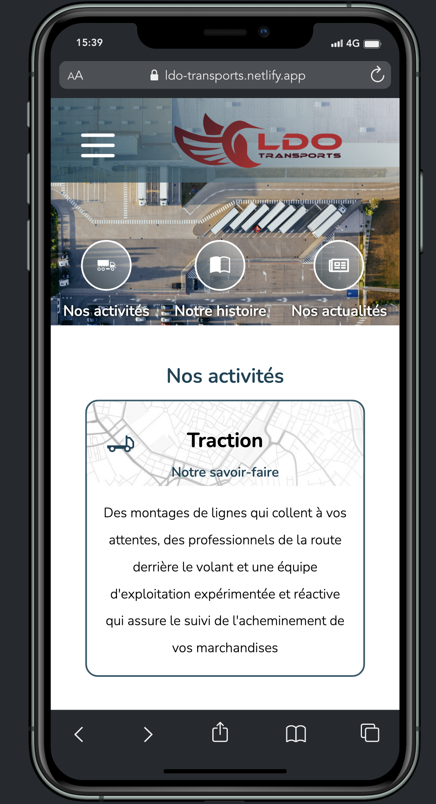
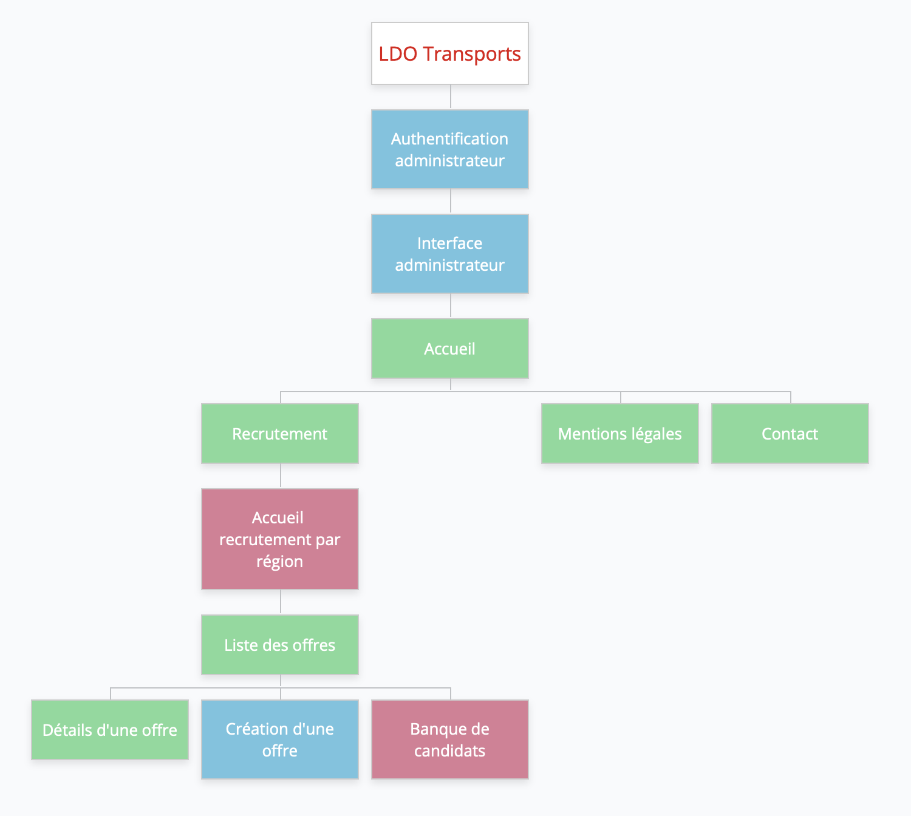
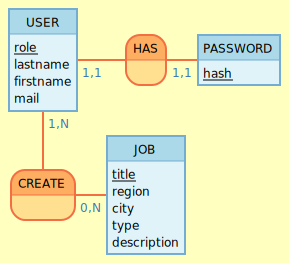

    

#
>Projet de fin d'étude : La solution web du transporteur LDO Transports (Toulouse)  
[Lien vers le projet](https://ldo-transports.netlify.app)  
[Lien vers la présentation YouTube (à 58 minutes et 11 secondes)](https://www.youtube.com/watch?v=2S5FSWNPA5g)

    

#
**

Présentation du projet
**

Ce projet émane d'un besoin client. 

L’entreprise LDO Transports est une entreprise de transport routier de marchandises, créée fin 2020, début 2021.  

Elle accompagne ses clients tels que Géodis, Chronopost, GLS dans l'acheminement des colis et marchandises générales.  

Elle est co-fondée par Laurent FAITG (le L de LDO) et Dogan OZBEY (les lettres DO de LDO).  

**

Définition des besoins
**

L’entreprise LDO Transports a besoin d’avoir une visibilité sur internet, pour ses clients, fournisseurs, employés et attirer de nouveaux collaborateurs :  conducteurs et administratifs. 

Cette solution permet au client d’évoluer autour de trois axes :

1. Une visibilité sur internet et un point de référence pour présenter l’entreprise auprès des clients actuels et à venir.  

2. Le recrutement de nouveaux collaborateurs (conducteurs) pour lequel il y a une pénurie depuis quelques années.  

3. La connexion des collaborateurs à l’aide d’un intranet (Hors scope MVP).  
 

**

Les fonctionnalités du projet
**
 
<u>**Liste des fonctionnalités du MVP :**</u>

- Authentifier l’administrateur à un espace dédié
- Présenter l’entreprise : *Home page*
   - L’histoire
   - Les activités
   - Les actualités
   - Situer l'entreprise
- Accéder aux offres de recrutement de l'entreprise : *pages recrutement*
   - Afficher les offres de recrutement de l’entreprise (par ordre chronologique inversé)
   - Poster une offre de recrutement
   - Supprimer une offre de recrutement
   - Modifier une offre de recrutement
   - Pouvoir postuler en ligne
   - Remplir un formulaire
   - Soumettre le formulaire (réception directe dans la boîte mail LDO)
   - Joindre un cv
   - Joindre un message
   - Pouvoir mettre en page le message d’une offre d’emploi lors de la création d’une offre avec l'éditeur Quill Js
- Afficher les mentions légales de l’entreprise : *page mentions légales*
- Pouvoir contacter l’entreprise : *page contact*

<u>**Liste Évolutions potentielles :**</u>

- Trier les offres de recrutement par région 
- Envoyer un mail de confirmation au candidat après réception de son formulaire de candidature
- Implémenter la consultation des candidatures sur le site
   - Afficher les candidatures liées à l’offre
   - Pouvoir télécharger le CV.pdf du candidat
   - Pouvoir consulter le message du candidat
- Implémenter la gestion des candidatures sur le site
   - Pouvoir accepter une candidature en envoyant un mail type d’acceptation
   - Pouvoir envoyer un mail aux services concernés après acceptation de la candidature en joignant le cv
   - Pouvoir refuser une candidature en envoyant un mail type de refus
   - Pouvoir supprimer les candidatures refusées de la base de données
- Implémenter le stockage des candidatures sur le site
   - Créer une banque de candidats consultable en connexion administrateur 
   - Pouvoir refuser une candidature en envoyant un mail type de refus et stocker la candidature en banque de candidats 
   - Pouvoir supprimer un candidat de la banque de candidats

<u>**Features suivantes :**</u>
- Gestion autonome des articles du site par le client
- Création d'un intranet pour communiquer entre les bureaux et les conducteurs (gestion des congés, des découchés, communication de documents de sécurité, de notes d'informations ect)

**

Stack technique du projet
**

<u>**Gestion de projet**</u>

- Github Projects 
- Git pour la partie versionning et collaboration
- Architecture MVC
- Méthode AGILE

<u>**Stack Front-end**</u>

- HTML5/CSS3
- Javascript
- EsLint (Linter)
- React
- React icons
- Quill Js
- Sass
- WebPack (build)
- Babel (Transpileur)
- Jwt

<u>**Stack Back-end**</u>

**Base de donnée :**  
- SGBD : Postgresql / SQL
- Utilisation de contraintes et domaines avec des RegEx pour contrôler et valider les données
- Utilisation de fonctions SQL pour les routes post/patch
- Respect de la 3FN

**Migration et versionning de BDD :**
- Sqitch
- Scripts pour le déploiement

**Confection API :**
- Modèles Active Record (POO, Classes…)
- Node.js
- Framework Express
- Gestion du cache avec Redis
- PG
- Nodemailer
- Multer
- sanitize-html
 
**Sécurité et validation de données :**
- Cors
- Dotenv
- JWT(JSON Web Token)
- Bcryptjs pour hacher les mdp
- Joi pour la validation et la description de schémas d'objets côté back

**Tests :**  
Tests unitaires avec Jest, Enzyme, Mocha et Chai

**Documentation :**  
JsDoc https://jsdoc.app/ 

**

La définition de la cible du projet
**  

**Les utilisateurs externes :**  

clients, fournisseurs et nouveaux collaborateurs.

Il est important de soigner l’expérience utilisateur pour faciliter l'accessibilité d’un public non familiarisé avec les technologies du web, comme par exemple des conducteurs routiers.

De plus, le projet doit être développé en mobile first, car le téléphone est le moyen d’accès le plus fréquent chez les conducteurs routiers

**Les utilisateurs internes :** 

le service Qualité, les Ressources Humaines, la Direction et les Employés (intranet pour une version ultérieure).

**

User stories
**  

**Visiteur (En tant que) :**

|Je dois pouvoir|Afin de|
|:-------------:|:-----:|
| accéder à la page d'accueil | visiter le site et découvrir l’entreprise |
| naviguer facilement sur le site |-|
| accéder aux mentions légales du site | être rassuré(e) concernant la fiabilité du site |
| accéder aux mentions légales du site | pouvoir avoir accès aux modalités de récupération et suppression des données personnelles |
| accéder à la page contact | contacter l’entreprise |
| choisir les offres en fonction de ma région | filtrer les offres |
| accéder à la liste des offres | chercher du travail |
| consulter une offre | voir le détail d’une offre |
| postuler à une offre | montrer mon intérêt pour le poste |
| recevoir une confirmation de ma candidature | savoir où j’en suis dans le process de recrutement |

**Administrateur (en tant que) :**

|Je dois pouvoir|Afin de|
|:-------------:|:-----:|
|accéder à une page de connexion|me connecter à mon espace administrateur|
|accéder à mon espace administrateur|modifier mon mot de passe|
|me déconnecter||
|créer une offre d’emploi|pourvoir un poste vacant|
|modifier une offre d’emploi|modifier une erreur de saisie par exemple|
|supprimer une offre d’emploi|clôturer le ou les recrutements|
|consulter les candidatures|afin de trier et choisir un candidat|
|télécharger les cv|afin de les consulter, de prendre des notes et de partager avec mes collègues sur la candidature|
|accepter une candidature|recruter un nouveau collaborateur|
|répondre à la candidature via un mail de validation type|valider la candidature et expliquer les modalités d'embauche|
|transférer les candidatures acceptées au service des Ressources Humaines|établir l’embauche du salarié|
|refuser une candidature||
|répondre à la candidature via un mail de refus type|spécifier que la candidature ne correspond pas aux attentes de l’entreprise|
|archiver une candidature intéressante|conserver une candidature intéressante et créer une banque de cv afin de gagner en réactivité sur un besoin futur|
|répondre à la candidature via un mail de refus type|mentionner la qualité de la candidature et donc sa conservation pour un besoin ultérieur|
|supprimer un cv archivé|nettoyer la banque de cv|
|consulter les cv archivés|reprendre contact avec une candidature intéressante avant de poster une nouvelle offre d’emploi et gagner en réactivité|

**

Arborescence du projet
** 

    

**Légende :**  
Vert : Arborescence visiteur  
Bleu : Arborescence Administrateur   
Rouge : Hors scope MVP    

**

MCD - MVP
** 

    

**

Wireframes - MVP
** 
**Pages Administrateur :**  
- [Interface Administrateur Desktop](conception/wireframes-mvp/0-admin/interfaceAdminDesktop.png)
- [Interface Administrateur Mobile](conception/wireframes-mvp/0-admin/interfaceAdminMobile.png)
- [Connection Administrateur Desktop](conception/wireframes-mvp/0-admin/connexionAdminDesktop.png)
- [Connection Administrateur Mobile](conception/wireframes-mvp/0-admin/connexionAdminMobile.png)

**Page accueil :**
- [Home page Desktop](conception/wireframes-mvp/1-home/homeDesktop.png)
- [Home page Mobile](conception/wireframes-mvp/1-home/homeMobile.png)
- [Menu burger](conception/wireframes-mvp/1-home/burger.png)

**Page Contact :**
- [Page Contact Desktop](conception/wireframes-mvp/2-contact/contactDesktop.png)
- [Page Contact Mobile](conception/wireframes-mvp/2-contact/contactMobile.png)

**Page Mentions Légales :**
- [Page Mentions Légales Desktop](conception/wireframes-mvp/3-legalNotice/legalNoticeDesktop.png)
- [Page Mentions Légales Mobile](conception/wireframes-mvp/3-legalNotice/legalNoticeMobile.png)

**Recrutement :**
- [Page Recrutement Desktop](conception/wireframes-mvp/4-recrutement/recrutementDesktop.png)
- [Page Recrutement Mobile](conception/wireframes-mvp/4-recrutement/recrutementMobile.png)
- [Page d'une offre Desktop](conception/wireframes-mvp/4-recrutement/oneOfferDesktop.png)
- [Page d'une offre Mobile](conception/wireframes-mvp/4-recrutement/oneOfferMobile.png)
- [Page de création d'une offre Desktop](conception/wireframes-mvp/4-recrutement/createOfferDesktop.png)
- [Page de création d'une offre Mobile](conception/wireframes-mvp/4-recrutement/createOfferMobile.png)

**

Liste des routes - MVP
** 

**Routes Back-end**

|Type de route|Chemin|Visiteur / Admin|Description|
|:----:|:----:|:----:|:---:|
|POST|/admin-signin|Admin|Connection en tant qu'administrateur, dirige vers la home page|
|POST|/admin-logged|Admin|Modification du mdp|
|POST|/contact|Visiteur|Envoyer un mail de contact|
|GET|/recrutement|Visiteur|Liste des offres|
|GET|/recrutement/:jobId|Visiteur|Détail d’une offre|
|PATCH|/recrutement/:jobId|Admin|Modification d’un job|
|DELETE|/recrutement/:jobId|Admin|Suppression d’un job|
|POST|/recrutement/add-job|Admin|Création d’un nouveau job|
|POST|/recrutement/:jobId|Visiteur|Postuler en ligne|

**Routes Front-end (react router)**

|Routes|Affichage|
|:---:|:---:|
|/admin-signin|page d’authentification administrateur|
|/admin-logged|interface administrateur|
|/|Home page|
|/contact|Page contact|
|/mentions-légales|Mentions légales|
|/recrutement|Liste des offres|
|/recrutement/:jobId|Détail d’une offre|
|/recrutement/add-job|Page création d’une offre|

---

